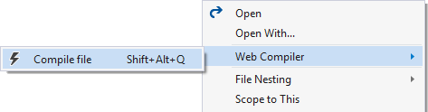
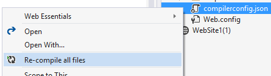
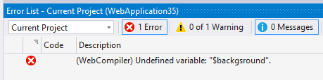

## Web Compiler

A Visual Studio extension that compiles LESS, Sass and CoffeeScript
files.

[](https://ci.appveyor.com/project/madskristensen/webcompiler)

Download the extension at the
[VS Gallery](https://visualstudiogallery.msdn.microsoft.com/3b329021-cd7a-4a01-86fc-714c2d05bb6c)
or get the
[nightly build](http://vsixgallery.com/extension/148ffa77-d70a-407f-892b-9ee542346862/)

### Getting started

Right-click and `.less`, `.scss` or `.coffee` file in Solution Explorer to
setup compilation.



A file called `compilerconfig.json` is created in the root of the
project. This file let's you modify the behavior of the compiler.

Right-clicking the `compilerconfig.json` file let's you easily
run all the configured compilers.



### Compile on save

Any time a `.less`, `.scss` or `.coffee` file is modified within Visual Studio,
the compiler runs automatically to produces the compiled output file.

The same is true when saving the `compilerconfig.json` file where
all configured files will be compiled.

### Error list

When a compiler error occurs, the error list in Visual Studio
will show the error and its exact location in the source file.



### Source maps

Source maps are supported for `.scss` files only for now, but the
plan is to have source map support for all languages.

### compilerconfig.json

The extension adds a `compilerconfig.json` file at the root of the
project which is used to configure all conmpilation.

Here's an example of what that file looks like:

```js
[
  {
    "outputFile": "output/site.css",
    "inputFile": "input/site.less",
    "minify": true,
    "includeInProject": true,
    "sourceMap": false
  },
  {
    "outputFile": "output/scss.css",
    "inputFile": "input/scss.scss",
    "minify": true,
    "includeInProject": true,
    "sourceMap": true
  }
]
```